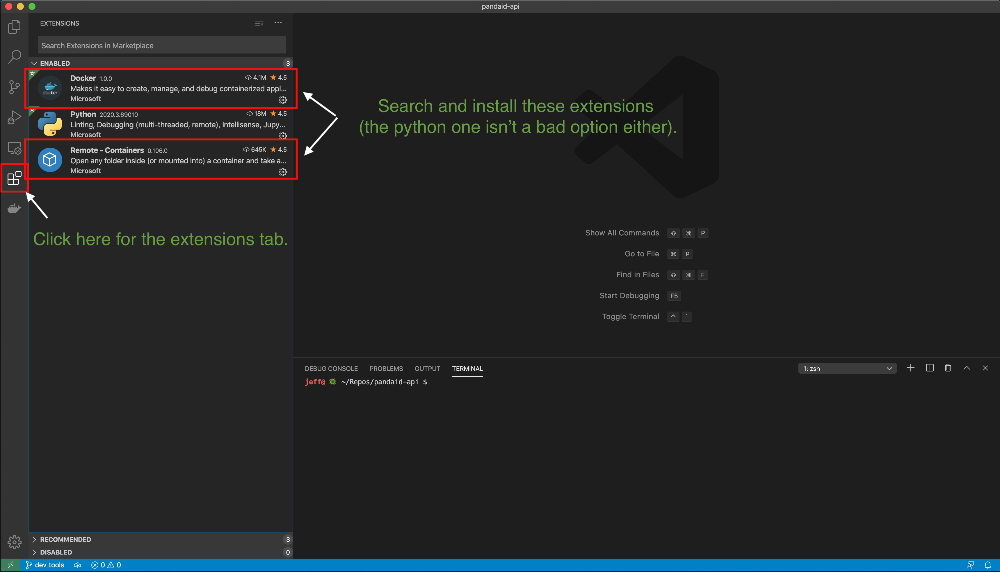
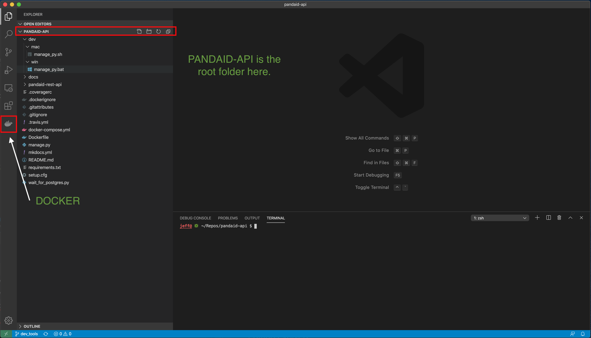
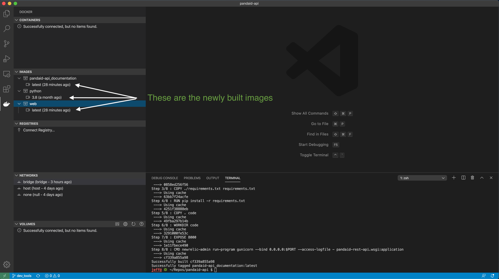
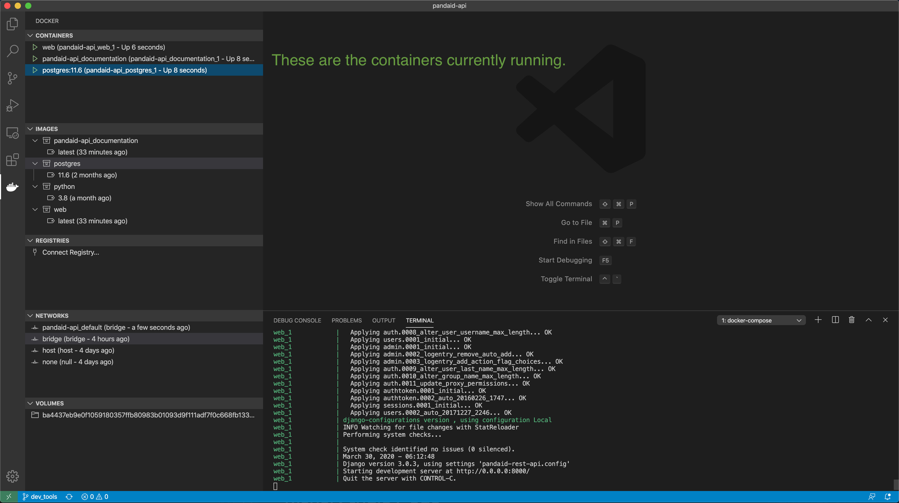
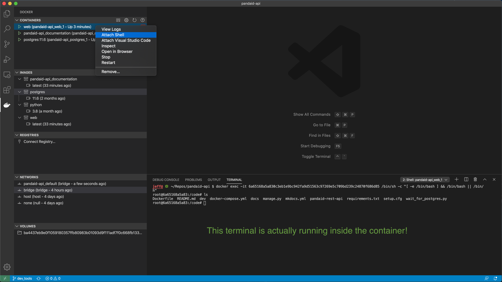
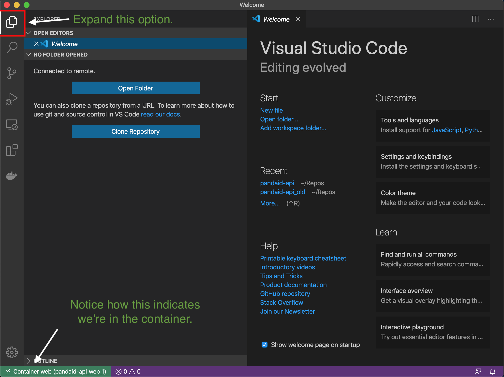
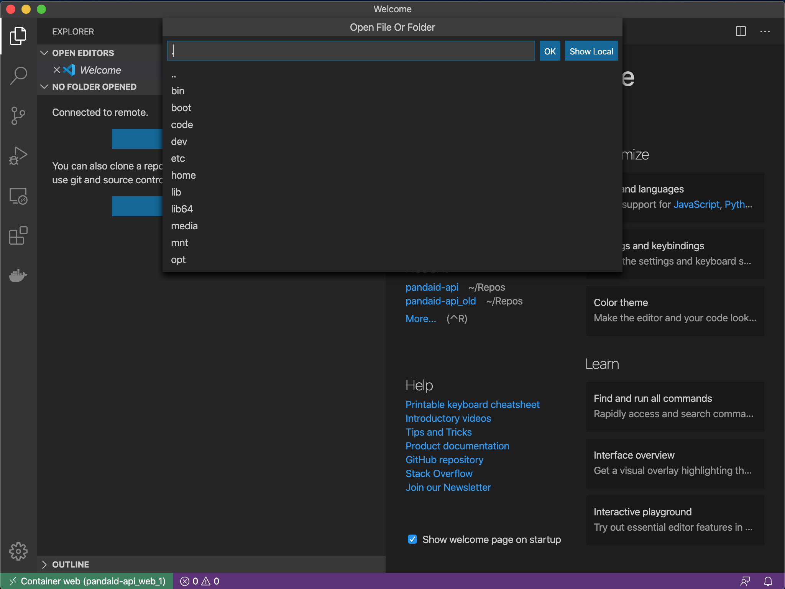
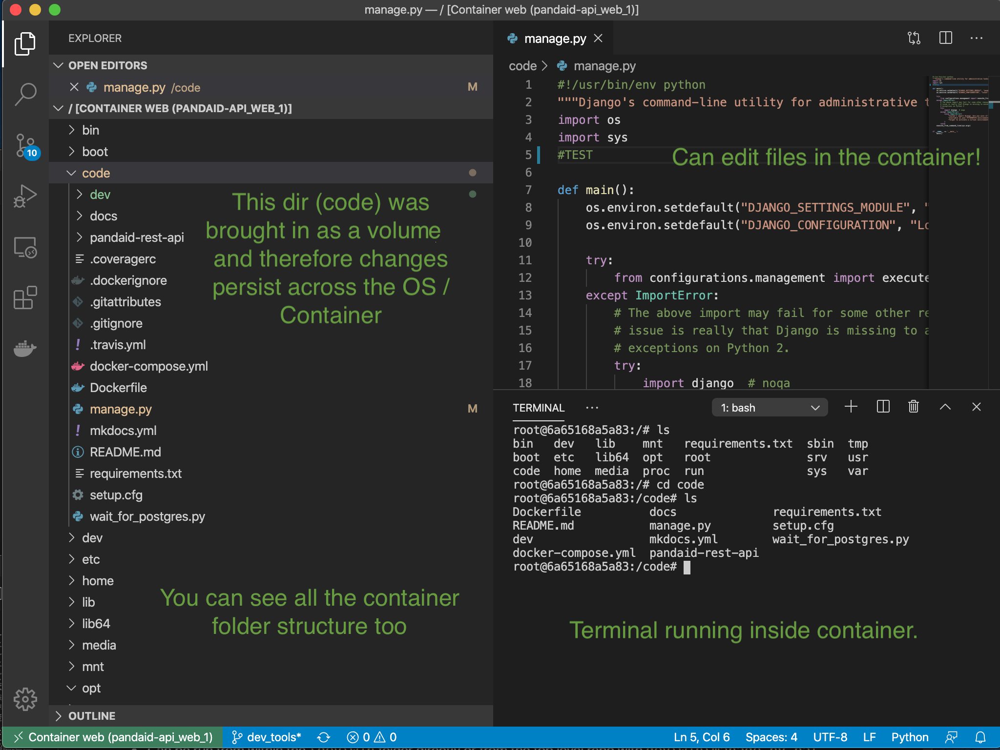

# Dev Tools
A collections of helper utilities to assist with common tasks.

## mac
### `manage_py.sh <arg>`
* Can be run from within the `/dev/mac` folder directly or from the top level repo with `dev/mac/manage_py.sh`
* Runs `manage.py` within the `web` container, passing through `arg`. 
    * `manage_py.sh -h`
        * Brings up the help for `manage.py`.
    * `manage_py.sh shell`
        * Opens Django's pre-configured IPython console within the `web` container. 

## win
### `manage_py.bat <arg>`
* Can be run from within the `\dev\win` folder directly or from the top level repo with `dev\win\manage_py.bat`
* Runs `manage.py` within the `web` container, passing through `arg`. 
    * `manage_py.bat -h`
        * Brings up the help for `manage.py`.
    * `manage_py.bat shell`
        * Opens Django's pre-configured IPython console within the `web` container. 

## VSCode Tools
Visual Studio Code has some pretty helpful extensions that provide a bit more visual interaction with Docker containers. 
1. Install VSCode for your platform [here](https://code.visualstudio.com/download).
2. Install the 'Docker' and 'Remote - Containers' Extensions (both authored by Microsoft)

3. Open VSCode and load the root repository folder with "Open folder" --> `pandaid-api`. Click on the "Docker" Extension.

4. If you haven't done so before, run `docker-compose build` from the terminal to build your `docker` containers. If the terminal screen isn't up, press "control + ~" to bring it up, or "Terminal" -> "New" from the menu bar. This command will take a good bit of time the first time as images are downloaded and built. You'll see them under "Images" on the sidebar.

5. Now running `docker-compose up` will start the images creating containers (or pull down an hosted image like postgres and start it). The containers will appear under "Containers" on the sidebar. The green triangles indicates the containers are running, red squares will indicate they've stopped.

6. If you right click on a container, you'll see additional options that are helpful. The first I want to highlight is "Attach Shell". This is actually running a `docker` command to get the shell in the container. By attaching a shell, you can open up a terminal inside one of your containers. In this case, I've opened a terminal in the `web` container, where the Django backend is running. This is another way to run `manage.py` or just explore what the working container actually has access to.

7. Another helpful option is "Attach Visual Studio Code". This option will allow you to have a full instance of VSCode inside of your container, for more options than just attaching a shell. It takes a second for the remote development container to install, but eventually it will bring up a new VSCode window inside of your container. Make sure to press the "Files" button on the tab-bar. 

8. Now click "Open Folder" and replace "/root/" with "/" or "." and press "OK".

9. I've expanded the "code" folder in the sidebar, as well as brought up a terminal. This terminal also is within the container itself. Now you can explore everything that's happening inside the container! It's good to note that files that are mounted as a volume will persist across the OS and container. Otherwise, changes to the container will only remain as long as the container exists (I think you can start/stop all you want, but if you re-build the changes disappear).

10. There are more options within the Docker tab that are worth exploring: Starting, Stopping, Removing, Logs, etc. A lot of the commands are visually ways to execute `docker` CLI commands, but I find them helpful to better understand how Docker works!
